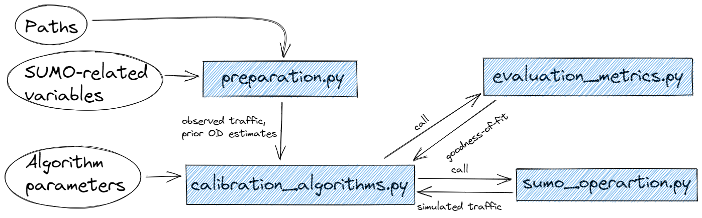

# A custom calibration and modeling toolbox for transportation researchers and engineers

[](https://opensource.org/licenses/Apache-2.0)

**Outline:**

- [About](#about) 
- [Framework](#framework) 
- [Requirements](#requirements)
- [Getting started](#started) 

## <a name='about'></a>About

This repository is where the [Chair of Transportation Systems (TSE)](https://www.mos.ed.tum.de/en/vvs/home/) at [Technical University of Munich (TUM)](https://www.tum.de/en/) share the platform for dynamic traffic assignment (DTA) and network calibration integrating with [Simulation of Urban MObility (SUMO)](https://sumo.dlr.de/docs/index.html) and the car-following model calibration platform. To find out more details about this toolbox, please check out the corresponding [Github page](https://laststriker11.github.io/calibration-modeling/) and [documentation](https://laststriker11.github.io/calibration-modeling/html/index.html).

By making this repository open source, the goal is to help the calibration of network OD matrices and car-following models, make the performance comparison among calibration models convenient, and motivate more scholars participating in the research domain of transportation model calibration.

If you are using these platforms in your work, please cite the following publication:
```
@article{qurashi2022dynamic,
  title={Dynamic demand estimation on large scale networks using Principal Component Analysis: The case of non-existent or irrelevant historical estimates},
  author={Qurashi, Moeid and Lu, Qing-Long and Cantelmo, Guido and Antoniou, Constantinos},
  journal={Transportation Research Part C: Emerging Technologies},
  volume={136},
  pages={103504},
  year={2022},
  publisher={Elsevier}
}
```

## <a name='framework'></a>Framework

The DTA model calibration platform is divided into four modules:

- Paths and data preparation (`preparation.py`): help load the paths (e.g., path to the network) and data required (e.g., traffic measurements). For more details about the methods and attributes in this module, please refer to [its module description](https://laststriker11.github.io/calibration-modeling/html/preparation.html).
- Algorithms (`calibration_algorithms.py`): implementing the calibration procedure. ([module description](https://laststriker11.github.io/calibration-modeling/html/calibration_algorithms.html))
- SUMO simulations (`sumo_operation.py`): run SUMO simulation and aggregate the simulation outputs. ([module description](https://laststriker11.github.io/calibration-modeling/html/sumo_operation.html))
- Evaluation (`evaluation_metrics.py`): calculate the goodness-of-fit. ([module description](https://laststriker11.github.io/calibration-modeling/html/evaluation_metrics.html))



<a name='requirements'></a>Requirements

To use this toolbox, you need to have Simulation of Urban MObility ([SUMO](https://sumo.dlr.de/docs/index.html)) installed on your PC or laptop.

To check if you have SUMO install, run the following command:

```
sumo
```

## <a name='started'></a>Getting started

To use this platform, three dictionary variables has to be given beforehand, including necessary paths, network setups, and algorithm variables.

An application example for using this platform is given at [`od_calibration/src/application_example.py`](./src/application_example.py).

